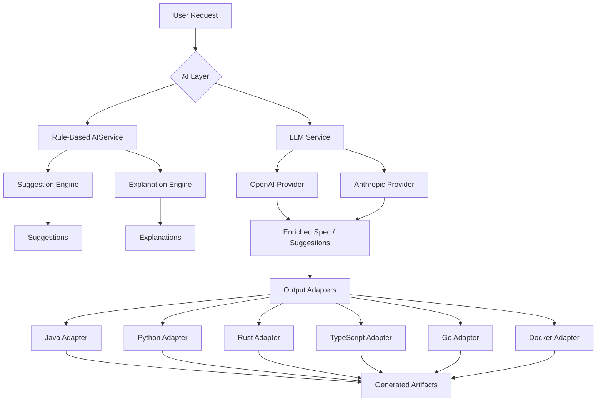
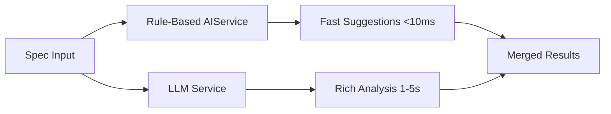
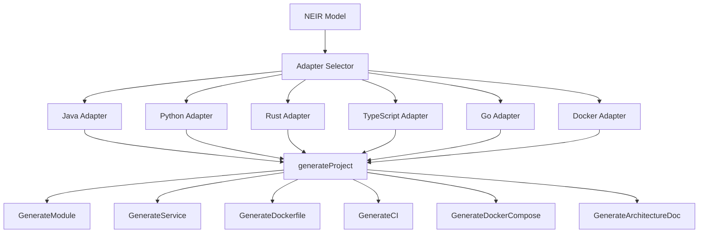
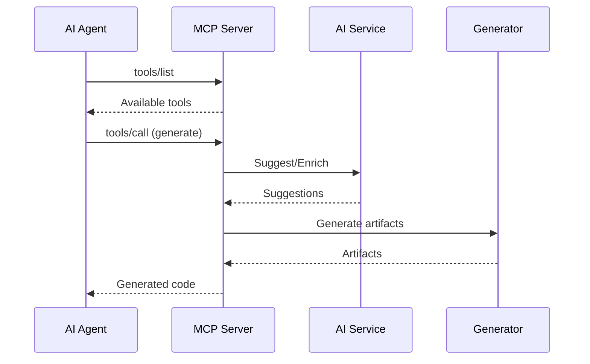

# NES-016 AI

## 1. Status
- Status: Draft
- Version: 0.3
- Owner: NAEOS Core Team

## 2. Purpose
This specification defines the role of AI assistants and automation support within the NAEOS ecosystem, including the dual-layer AI architecture (rule-based + LLM), provider integration, and output adapter system.

## 3. Scope
The AI layer covers:
- Rule-based specification analysis (`internal/ai/ai.go`)
- LLM service integration (`internal/ai/llm.go`)
- Output adapter architecture (`internal/generation/adapters/`)
- AI agent integration via MCP (`internal/mcp/`)
- Specification-driven AI workflows
- Prompt engineering guidelines
- AI-generated artifact validation

## 4. Requirements
### 4.1 Functional Requirements
- FR-001: AI agents shall be able to read and interpret NAEOS specifications.
- FR-002: AI agents shall generate artifacts that conform to NAEOS standards.
- FR-003: AI-generated artifacts shall pass NAEOS validation and review.
- FR-004: AI interactions shall be governed by NAEOS policy rules.
- FR-005: The AI service shall provide fast rule-based suggestions without network calls.
- FR-006: The LLM service shall support multiple providers (OpenAI, Anthropic).
- FR-007: Output adapters shall generate language-specific project structures.

### 4.2 Non-Functional Requirements
- NFR-001: AI-generated code shall be traceable to source specifications.
- NFR-002: AI behavior shall be auditable through governance logs.
- NFR-003: Rule-based suggestions shall complete in <10ms.
- NFR-004: LLM calls shall have configurable timeouts (default 30s).

## 5. Architecture



## 6. Dual-Layer AI Architecture

NAEOS implements a two-tier AI system:

### 6.1 Rule-Based AIService
Fast, deterministic analysis with no network calls.

```go
type AIService struct {
    // context map[string]any — internal analysis state
}

func NewService() *AIService
func (s *AIService) Suggest(specContent string) ([]Suggestion, error)
func (s *AIService) Explain(topic, specContent string) (*Explanation, error)
```

**Suggestion Rules:**

| Rule | Priority | Trigger |
|------|----------|---------|
| Missing `architecture:` section | high | Spec lacks architecture definition |
| Missing `deployment:` section | medium | Spec lacks deployment config |
| Missing `testing:` section | medium | Spec lacks test definition |
| Port < 1024 | high | Security warning for privileged ports |
| Missing `description:` section | low | Spec lacks description |
| > 5 `name:` fields | medium | Hint to split into modules |
| No issues found | info | "Looks good" confirmation |

**Explanation Topics:**

| Topic | Content |
|-------|---------|
| `pipeline` | NAEOS pipeline execution model |
| `neir` | NEIR (Nusantara Entity-Interface-Representation) model |
| `architecture` | Architecture patterns and best practices |
| `kernel` | Kernel system explanation |

### 6.2 LLM Service
Rich, context-aware analysis via external LLM APIs.

```go
type LLMConfig struct {
    Provider  LLMProvider
    APIKey    string
    Model     string
    MaxTokens int
    Timeout   time.Duration
    BaseURL   string
}

type LLMService struct {
    // config LLMConfig, httpClient *http.Client
}

func NewLLMService(config LLMConfig) *LLMService
func (s *LLMService) EnrichSpec(specContent string) (string, error)
func (s *LLMService) GenerateSuggestions(specContent string) ([]Suggestion, error)
func (s *LLMService) ExplainArchitecture(specContent, architecture string) (string, error)
```

**Provider Comparison:**

| Feature | OpenAI | Anthropic |
|---------|--------|-----------|
| Default Model | `gpt-4o-mini` | `claude-3-haiku-20240307` |
| Max Tokens | 1024 | 1024 |
| Temperature | 0.3 | — |
| API Endpoint | Configurable `BaseURL` | `/v1/messages` |
| API Version | — | `2023-06-01` |
| OpenAI-Compatible | Native | No |

**Key Methods:**

| Method | Description |
|--------|-------------|
| `EnrichSpec` | Sends specification to LLM for enrichment with best practices |
| `GenerateSuggestions` | Asks LLM to produce JSON array of `Suggestion` structs |
| `ExplainArchitecture` | Explains an architecture pattern in context of the spec |

### 6.3 Composition Pattern

The two layers can be composed for optimal results:



- **AIService**: Fast, deterministic, no network — use for immediate feedback
- **LLMService**: Rich, context-aware — use for deeper analysis

## 7. Output Adapters

Language-specific code generators that produce project structures from NEIR models.



### Adapter Methods

| Method | Description |
|--------|-------------|
| `GenerateProject` | Creates complete project directory structure |
| `GenerateModule` | Generates a single module with dependencies |
| `GenerateService` | Generates service layer code |
| `GenerateDockerfile` | Produces Dockerfile for the service |
| `GenerateCI` | Generates CI/CD pipeline configuration |
| `GenerateDockerCompose` | Produces docker-compose.yml |
| `GenerateArchitectureDoc` | Generates architecture documentation |

### Supported Languages

| Adapter | Language | Package Manager | Build Tool |
|---------|----------|----------------|------------|
| Java | Java 17+ | Maven/Gradle | Maven/Gradle |
| Python | Python 3.10+ | pip/poetry | — |
| Rust | Rust 2021+ | Cargo | Cargo |
| TypeScript | TypeScript 5+ | npm/yarn/pnpm | tsc |
| Go | Go 1.22+ | go modules | go build |

## 8. MCP Integration

AI agents connect to NAEOS via the Model Context Protocol (MCP):



## 9. Integration Points

| Consumer | How It Uses AI |
|----------|---------------|
| `cmd/naeos/ai_cmd.go` | CLI `ai suggest`, `ai explain` commands |
| `cmd/naeos/compile_cmd.go` | Uses AIService for pre-compilation suggestions |
| `internal/mcp/server.go` | Exposes AI tools via MCP protocol |
| `internal/compiler/compiler.go` | Uses output adapters for code generation |

## 10. Constraints

AI tidak boleh:
- Menghasilkan kode tanpa spesifikasi yang jelas.
- Mengabaikan governance rules.
- Menghasilkan placeholder atau TODO tanpa justifikasi.
- Melanggar batas-batas yang didefinisikan dalam policy.
- Menggunakan LLM tanpa timeout yang terkonfigurasi.

## 11. Acceptance Criteria
- [ ] AI agents can read and interpret NAEOS specifications.
- [ ] AI-generated artifacts pass NAEOS validation.
- [ ] AI behavior is auditable through governance logs.
- [ ] Rule-based suggestions complete in <10ms.
- [ ] LLM calls respect configured timeouts.
- [ ] All 5 output adapters produce valid project structures.
- [ ] MCP integration exposes AI tools correctly.
