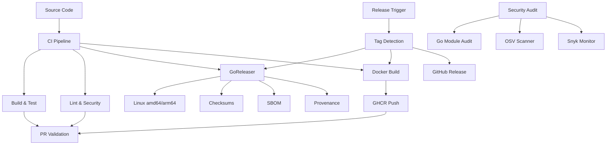
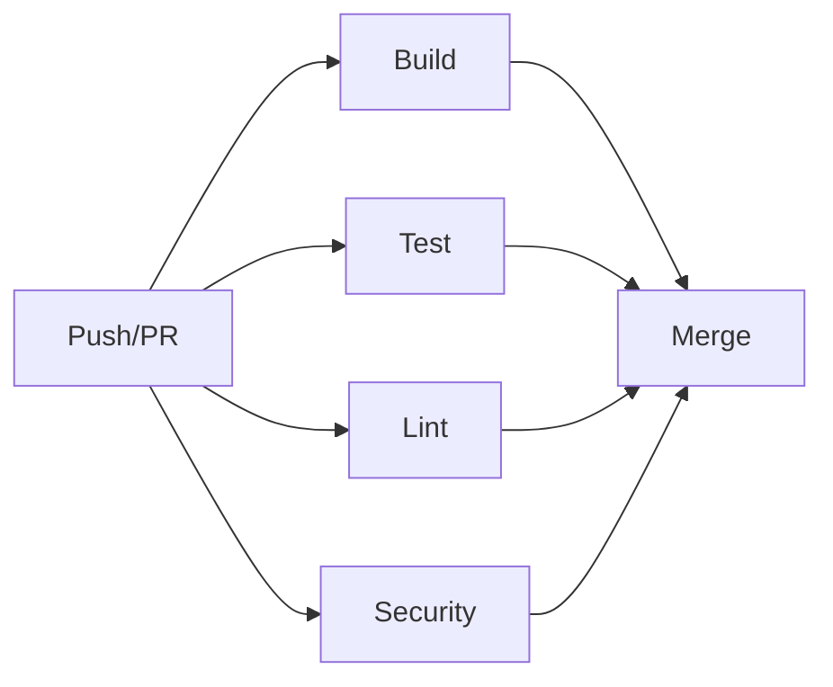
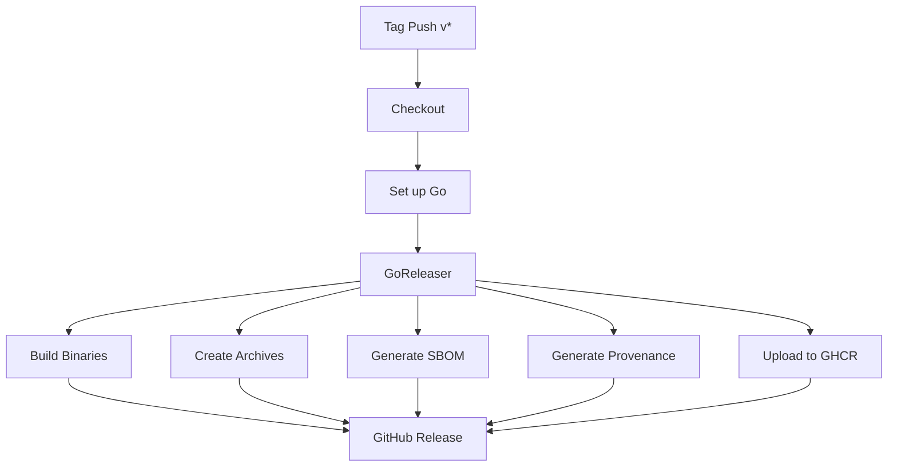

# NES-018 Cloud

## 1. Status
- Status: Draft
- Version: 0.3
- Owner: NAEOS Core Team

## 2. Purpose
This specification defines the target deployment and cloud operations layer for NAEOS-generated artifacts, including containerization, release management, CI/CD automation, and cloud provider integration.

## 3. Scope
The cloud layer covers:
- Containerization (Docker multi-stage builds)
- Release management (GoReleaser)
- CI/CD automation (5 workflows)
- Deployment strategies
- Health checks and monitoring
- Cloud provider integration

## 4. Requirements
### 4.1 Functional Requirements
- FR-001: NAEOS shall generate Dockerfile for containerized deployment.
- FR-002: NAEOS shall support docker-compose generation for local development.
- FR-003: NAEOS shall support Kubernetes deployment configurations.
- FR-004: NAEOS shall generate CI/CD workflow files.
- FR-005: NAEOS shall generate release artifacts via GoReleaser.
- FR-006: NAEOS shall generate SBOM for dependency tracking.
- FR-007: NAEOS shall generate build provenance attestations.

### 4.2 Non-Functional Requirements
- NFR-001: Generated deployment artifacts shall be production-ready.
- NFR-002: Deployment configurations shall follow security best practices.
- NFR-003: Release artifacts shall be reproducible.
- NFR-004: CI/CD workflows shall complete in <10 minutes.

## 5. Architecture



## 6. Containerization

### 6.1 Docker Multi-Stage Build

```dockerfile
# Build stage
FROM golang:1.22-alpine AS builder
RUN apk add --no-cache git
WORKDIR /app
COPY go.mod go.sum ./
RUN go mod download
COPY . .
RUN CGO_ENABLED=0 GOOS=linux go build -o /naeos ./cmd/naeos

# Runtime stage
FROM alpine:3.19
RUN apk add --no-cache ca-certificates
COPY --from=builder /naeos /usr/local/bin/naeos
EXPOSE 8080
HEALTHCHECK CMD naeos health || exit 1
ENTRYPOINT ["naeos"]
```

### 6.2 Docker Compose

```yaml
# docker-compose.yaml
version: "3.9"
services:
  naeos:
    build: .
    ports:
      - "8080:8080"
    environment:
      - NAEOS_ENV=development
    healthcheck:
      test: ["CMD", "naeos", "health"]
      interval: 10s
      timeout: 5s
      retries: 3
```

### 6.3 Container Best Practices

| Practice | Implementation |
|----------|---------------|
| Non-root user | `USER naeos` in Dockerfile |
| Read-only filesystem | `--read-only` mount |
| Minimal base | Alpine 3.19 (~5MB) |
| Health checks | Built-in `HEALTHCHECK` |
| Multi-stage | Separate build/runtime |
| Layer caching | `go mod download` before COPY |

## 7. Release Management

### 7.1 GoReleaser Configuration

```yaml
# .goreleaser.yaml
version: 2
project_name: naeos

builds:
  - id: naeos
    main: ./cmd/naeos
    binary: naeos
    goos: [linux, darwin, windows]
    goarch: [amd64, arm64]

archives:
  - id: naeos-archive
    format: tar.gz
    name_template: "{{ .ProjectName }}-{{ .Version }}-{{ .Os }}-{{ .Arch }}"

checksum:
  name_template: "checksums.txt"

sboms:
  - artifacts: archive

changelog:
  sort: asc
  use: github
  groups:
    - title: Breaking Changes
      regexp: '^.*?(\bbreaking\b|!\:).*?$'
    - title: Features
      regexp: '^.*?\bfeat(ure)?\b.*?$'
    - title: Bug Fixes
      regexp: '^.*?\bfix\b.*?$'

release:
  github:
    owner: NAEOS-foundation
    name: naeos
```

### 7.2 Generated Artifacts

| Artifact | Description |
|----------|-------------|
| `naeos-{version}-linux-amd64.tar.gz` | Linux binary |
| `naeos-{version}-linux-arm64.tar.gz` | Linux ARM binary |
| `naeos-{version}-darwin-amd64.tar.gz` | macOS Intel binary |
| `naeos-{version}-darwin-arm64.tar.gz` | macOS Apple Silicon binary |
| `naeos-{version}-windows-amd64.tar.gz` | Windows binary |
| `checksums.txt` | SHA-256 checksums |
| `naeos-{version}.sbom.json` | Software Bill of Materials |
| `naeos-{version}.intoto.jsonl` | Build provenance |

## 8. CI/CD Workflows

### 8.1 Workflow Inventory

| Workflow | Trigger | Description |
|----------|---------|-------------|
| `ci.yml` | Push to main, PR | Build, test, lint, security scan |
| `release.yml` | Tag push (v*) | GoReleaser build + GitHub Release |
| `security-audit.yml` | Daily cron | go module audit, OSV scan |
| `snyk-monitor.yml` | Weekly cron | Dependency vulnerability monitoring |
| `pr-validation.yml` | PR events | Comprehensive PR checks |

### 8.2 CI Pipeline (`ci.yml`)



**Steps:**
1. `go build ./...` — Verify compilation
2. `go test -race -coverprofile=coverage.out ./...` — Run tests with race detection
3. `golangci-lint run` — Lint code
4. `govulncheck ./...` — Check for vulnerabilities

### 8.3 Release Pipeline (`release.yml`)



### 8.4 Security Pipelines

| Pipeline | Schedule | Actions |
|----------|----------|---------|
| Security Audit | Daily 02:00 UTC | `go mod verify`, `govulncheck`, OSV Scanner |
| Snyk Monitor | Weekly Monday 03:00 UTC | Dependency monitoring, alert creation |

## 9. Deployment Strategies

| Strategy | Description | Use Case |
|----------|-------------|----------|
| Rolling | Update pods bertahap | Default, zero-downtime |
| Blue-Green | Deploy versi baru di samping lama | Critical services |
| Canary | Deploy ke subset users | Risk mitigation |

### 9.1 Rolling Update

```yaml
apiVersion: apps/v1
kind: Deployment
metadata:
  name: naeos
spec:
  replicas: 3
  strategy:
    type: RollingUpdate
    rollingUpdate:
      maxSurge: 1
      maxUnavailable: 0
```

### 9.2 Health Checks

| Check | Endpoint | Interval |
|-------|----------|----------|
| Liveness | `/healthz` | 10s |
| Readiness | `/readyz` | 5s |
| Startup | `/startupz` | 1s (initial) |

## 10. Integration Points

| Consumer | How It Uses Cloud |
|----------|------------------|
| `cmd/naeos/compile_cmd.go` | Generates Dockerfile + docker-compose |
| `.goreleaser.yaml` | GoReleaser build configuration |
| `.github/workflows/ci.yml` | CI pipeline |
| `.github/workflows/release.yml` | Release pipeline |
| `internal/docker/` | Dockerfile generation (planned) |

## 11. Acceptance Criteria
- [ ] Generated Dockerfile produces a working container.
- [ ] docker-compose.yaml runs locally without modification.
- [ ] CI/CD workflows build and test automatically.
- [ ] GoReleaser generates cross-platform binaries.
- [ ] SBOM is generated for each release.
- [ ] Security audits run on schedule.
- [ ] Health checks respond correctly.
