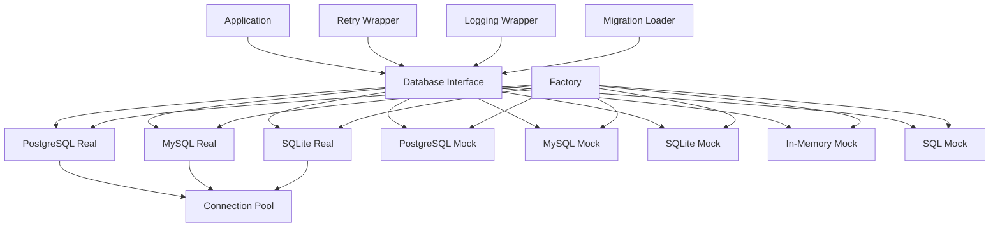

# NES-042 Database

## 1. Status
- Status: Draft
- Version: 0.2
- Owner: NAEOS Core Team

## 2. Purpose
This specification defines the pluggable database layer for NAEOS, supporting PostgreSQL, MySQL, and SQLite with production-ready features including context support, connection pooling, retry logic, query logging, and health checks.

## 3. Scope
The database layer covers:
- Database interface with context support
- Real adapters (PostgreSQL, MySQL, SQLite)
- Mock adapters (in-memory, SQL)
- Factory pattern with config validation
- Retry logic with exponential backoff
- Query logging decorator
- File-based migration loader
- Health checks

## 4. Requirements
### 4.1 Functional Requirements
- FR-001: Database interface shall support `context.Context` for timeouts and cancellation.
- FR-002: Database shall support transactions via `BeginTx`.
- FR-003: Database shall support schema migrations with rollback.
- FR-004: Database shall support file-based migration loading.
- FR-005: Database shall support retry with exponential backoff.
- FR-006: Database shall support query logging decorator.
- FR-007: Database shall support health checks.
- FR-008: Database shall support connection pool configuration.

### 4.2 Non-Functional Requirements
- NFR-001: Database drivers shall use build tags for conditional compilation.
- NFR-002: Config shall validate host, port, and SSLMode.
- NFR-003: Retry shall detect transient errors (net.Error, connection refused/reset/broken pipe/EOF/timeout).
- NFR-004: Query logging shall detect slow queries (>1s).

## 5. Architecture



## 6. Core Interface

```go
type Database interface {
    ExecContext(ctx context.Context, query string, args ...any) (sql.Result, error)
    QueryContext(ctx context.Context, query string, args ...any) (*sql.Rows, error)
    QueryRowContext(ctx context.Context, query string, args ...any) *sql.Row
    BeginTx(ctx context.Context) (Transaction, error)
    Ping() error
    Close() error
    Migrate(migrations []Migration) error
    MigrateContext(ctx context.Context, migrations []Migration) error
    Rollback(migrationID int) error
    RollbackContext(ctx context.Context, migrationID int) error
    LoadMigrations(dir string) ([]Migration, error)
    HealthCheck() error
}

type Transaction interface {
    ExecContext(ctx context.Context, query string, args ...any) (sql.Result, error)
    QueryContext(ctx context.Context, query string, args ...any) (*sql.Rows, error)
    QueryRowContext(ctx context.Context, query string, args ...any) *sql.Row
    Commit() error
    Rollback() error
}
```

## 7. Configuration

```go
type Config struct {
    Host            string
    Port            int
    User            string
    Password        string
    Database        string
    SSLMode         string        // disable, require, verify-ca, verify-full
    Timeout         time.Duration
    MaxOpenConns    int           // default: 25
    MaxIdleConns    int           // default: 5
    ConnMaxLifetime time.Duration // default: 5m
    ConnMaxIdleTime time.Duration // default: 0
}
```

### Config Validation

| Rule | Description |
|------|-------------|
| Host required | Cannot be empty |
| Positive port | Must be > 0 |
| Valid SSLMode | Must be one of: disable, require, verify-ca, verify-full |

## 8. Adapters

### 8.1 PostgreSQL

| Feature | Implementation |
|---------|---------------|
| Driver | `github.com/lib/pq` |
| Build Tag | `postgres` |
| SSL Modes | disable, require, verify-ca, verify-full |
| Default Port | 5432 |
| Down SQL | Stored in `_migrations` table |
| Context Support | Full (ExecContext, QueryContext, BeginTx) |

### 8.2 MySQL

| Feature | Implementation |
|---------|---------------|
| Driver | `github.com/go-sql-driver/mysql` |
| Build Tag | `mysql` |
| DSN Format | `user:password@tcp(host:port)/database?parseTime=true` |
| Default Port | 3306 |
| Down SQL | Stored in `_migrations` table |
| Context Support | Full |

### 8.3 SQLite

| Feature | Implementation |
|---------|---------------|
| Driver | `modernc.org/sqlite` (pure Go) |
| Build Tag | `sqlite` |
| File-based | WAL mode, foreign keys, busy timeout |
| In-memory | MaxOpenConns=1, no WAL |
| Default Port | N/A (file-based) |
| Down SQL | Stored in `_migrations` table |
| Context Support | Full |

### 8.4 Mock Adapters

| Adapter | Description | Use Case |
|---------|-------------|----------|
| PostgreSQL Mock | Extends `BaseDatabase` | Testing with PostgreSQL features |
| MySQL Mock | Extends `BaseDatabase` | Testing with MySQL features |
| SQLite Mock | Extends `BaseDatabase` | Testing with SQLite features |
| In-Memory Mock | `InMemoryDatabase` struct | Unit testing without SQL |
| SQL Mock | `SQLMockDatabase` struct | Testing with sqlmock library |

### 8.5 BaseDatabase

Shared mock base reducing code duplication:

```go
type BaseDatabase struct {
    Migrations []Migration
}

func (db *BaseDatabase) ExecContext(ctx, query, args) (sql.Result, error)
func (db *BaseDatabase) QueryContext(ctx, query, args) (*sql.Rows, error)
func (db *BaseDatabase) QueryRowContext(ctx, query, args) *sql.Row
func (db *BaseDatabase) BeginTx(ctx) (Transaction, error)
func (db *BaseDatabase) Ping() error
func (db *BaseDatabase) Close() error
func (db *BaseDatabase) Migrate(migrations) error
func (db *BaseDatabase) MigrateContext(ctx, migrations) error
func (db *BaseDatabase) Rollback(id) error
func (db *BaseDatabase) RollbackContext(ctx, id) error
func (db *BaseDatabase) LoadMigrations(dir) ([]Migration, error)
func (db *BaseDatabase) HealthCheck() error
```

## 9. Factory Pattern

```go
// Create by driver name (returns mock adapter)
db := database.New("postgresql")

// Create with config validation (returns real adapter)
db, err := database.NewFromConfig("postgresql", &database.Config{
    Host:     "localhost",
    Port:     5432,
    User:     "admin",
    Password: "secret",
    Database: "naeos",
    SSLMode:  "disable",
})
```

| Method | Returns | Validation |
|--------|---------|------------|
| `New(driver)` | Mock adapter | None |
| `NewFromConfig(driver, config)` | Real adapter | Config.Validate() |

## 10. Retry Logic

```go
err := database.WithRetry(ctx, 3, 100*time.Millisecond, func(ctx context.Context) error {
    return db.Ping()
})
```

### Retry Parameters

| Parameter | Default | Description |
|-----------|---------|-------------|
| MaxRetries | 3 | Maximum retry attempts |
| BaseDelay | 100ms | Initial delay between retries |
| Backoff | Exponential | Delay doubles each retry |

### Transient Error Detection

| Error Type | Detected |
|------------|----------|
| `net.Error` | Yes |
| Connection refused | Yes |
| Connection reset | Yes |
| Broken pipe | Yes |
| EOF | Yes |
| Timeout | Yes |

## 11. Query Logging

```go
logger := slog.New(slog.NewJSONHandler(os.Stdout, nil))
db := database.NewLoggingDatabase(realDB, logger)
```

### Log Levels

| Level | Trigger |
|-------|---------|
| Debug | Query execution start |
| Info | Query completion |
| Warn | Slow query (>1s) |
| Error | Query failure |

## 12. Migrations

### Programmatic Migrations

```go
migrations := []database.Migration{
    {
        Version: 1,
        Name:    "create_users",
        Up:      "CREATE TABLE users (id SERIAL PRIMARY KEY, name TEXT)",
        Down:    "DROP TABLE users",
    },
}

err := db.Migrate(migrations)
err = db.Rollback(0) // rollback all
```

### File-Based Migrations

```go
migrations, err := database.LoadMigrations("./migrations")
// Files: 000001_create_users.up.sql, 000001_create_users.down.sql
```

### Migration Table

```sql
CREATE TABLE _migrations (
    id SERIAL PRIMARY KEY,
    version INTEGER NOT NULL,
    name TEXT NOT NULL,
    up_sql TEXT NOT NULL,
    down_sql TEXT NOT NULL,
    applied_at TIMESTAMP DEFAULT CURRENT_TIMESTAMP
);
```

## 13. Health Checks

```go
if err := db.HealthCheck(); err != nil {
    log.Printf("database unhealthy: %v", err)
}
```

| Adapter | Health Check |
|---------|-------------|
| PostgreSQL | `SELECT 1` |
| MySQL | `SELECT 1` |
| SQLite | `SELECT 1` |
| Mock | Always healthy |

## 14. Integration Points

| Consumer | How It Uses Database |
|----------|---------------------|
| `cmd/naeos/db_cmd.go` | CLI database commands |
| `internal/api/server.go` | API server health check |
| `internal/database/database.go` | Core interface + Factory |
| `internal/database/retry.go` | Retry wrapper |
| `internal/database/logging.go` | Logging decorator |
| `internal/database/migrations.go` | Migration loader |

## 15. Build Tags

```bash
# Exclude database drivers
go build -tags nosql ./...

# Include specific driver
go build -tags postgres ./...
go build -tags mysql ./...
go build -tags sqlite ./...
```

## 16. Acceptance Criteria
- [ ] All adapters implement the Database interface.
- [ ] Context support works with timeouts and cancellation.
- [ ] Connection pool configuration is applied correctly.
- [ ] Retry logic detects transient errors.
- [ ] Query logging detects slow queries.
- [ ] Health checks return correct status.
- [ ] File-based migrations load correctly.
- [ ] Config validation rejects invalid configurations.
