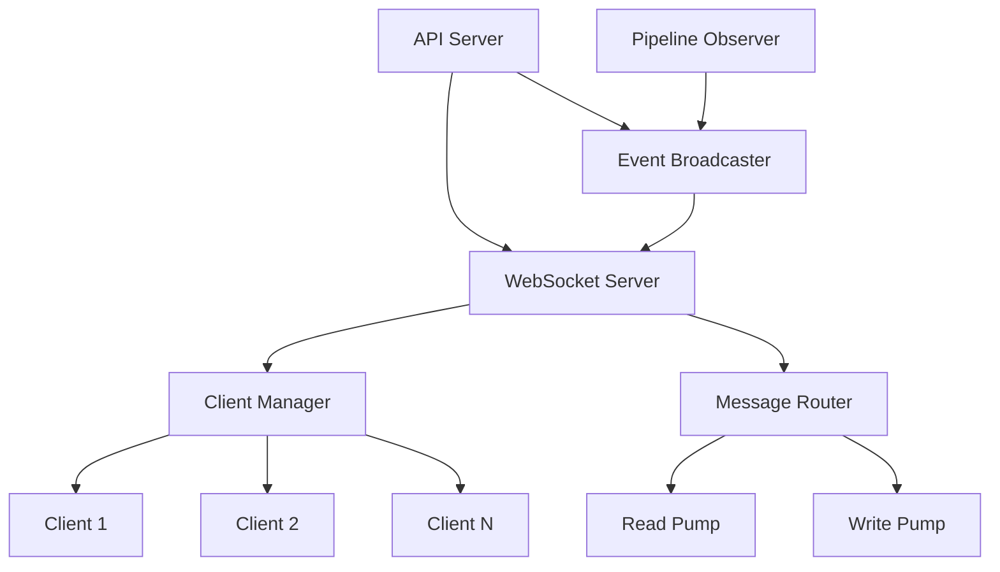
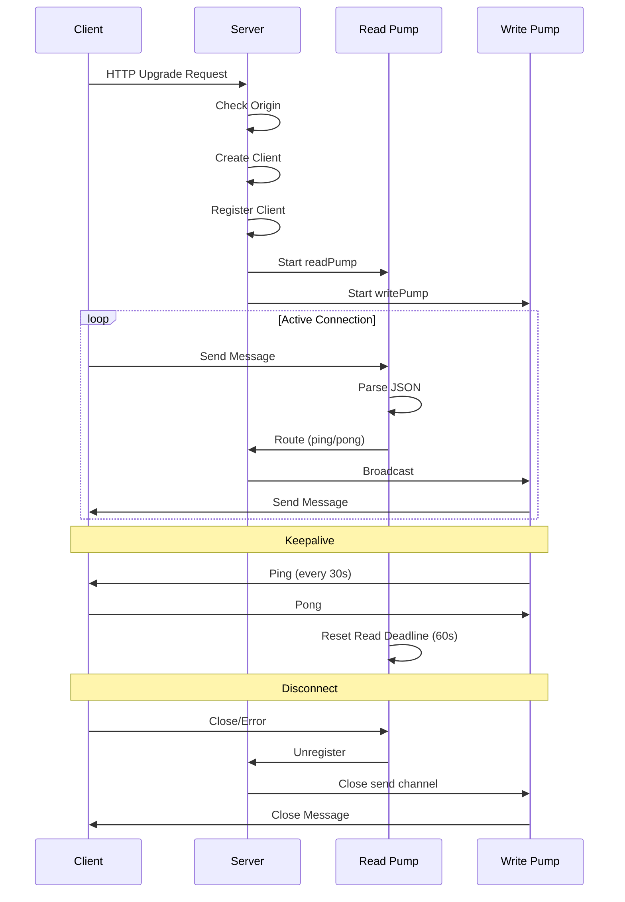

# NES-043 WebSocket

## 1. Status
- Status: Draft
- Version: 0.1
- Owner: NAEOS Core Team

## 2. Purpose
This specification defines the WebSocket layer for real-time communication between the API server and connected clients, enabling live pipeline progress updates, event broadcasting, and bidirectional messaging.

## 3. Scope
The WebSocket layer covers:
- WebSocket server with gorilla/websocket
- Client management with concurrent-safe operations
- Event broadcasting to all connected clients
- Pipeline observer integration
- Message types and protocol
- Connection lifecycle management

## 4. Requirements
### 4.1 Functional Requirements
- FR-001: Server shall accept WebSocket connections via HTTP upgrade.
- FR-002: Server shall broadcast events to all connected clients.
- FR-003: Server shall manage client connections (register/unregister).
- FR-004: Server shall support ping/pong keepalive.
- FR-005: Server shall support origin-based CORS restrictions.
- FR-006: Server shall implement PipelineObserver for live updates.

### 4.2 Non-Functional Requirements
- NFR-001: Server shall handle concurrent client connections safely.
- NFR-002: Server shall detect and disconnect slow clients.
- NFR-003: Server shall send close messages on shutdown.

## 5. Architecture



## 6. Core Types

### 6.1 Server

```go
type Server struct {
    clients         map[*Client]bool
    broadcast       chan []byte
    register        chan *Client
    unregister      chan *Client
    mu              sync.RWMutex
    allowedOrigins  []string
    upgrader        websocket.Upgrader
}
```

### 6.2 Client

```go
type Client struct {
    conn    *websocket.Conn
    server  *Server
    send    chan []byte
    id      string
    created time.Time
    writeMu sync.Mutex
}
```

### 6.3 Message

```go
type Message struct {
    Type    string      `json:"type"`
    Payload any         `json:"payload"`
    Time    time.Time   `json:"time"`
}
```

## 7. Message Types

| Type | Direction | Payload | Description |
|------|-----------|---------|-------------|
| `system` | Server → Client | `{message: string}` | System notifications |
| `pipeline.started` | Server → Client | `{pipeline_id: string}` | Pipeline execution started |
| `pipeline.completed` | Server → Client | `{pipeline_id: string, duration: string}` | Pipeline completed |
| `pipeline.failed` | Server → Client | `{pipeline_id: string, error: string}` | Pipeline failed |
| `spec.validated` | Server → Client | `{valid: bool, errors: []string}` | Specification validation result |
| `artifact.generated` | Server → Client | `{name: string, path: string}` | Artifact generated |
| `log` | Server → Client | `{level: string, message: string}` | Log message |
| `ping` | Client → Server | — | Keepalive ping |
| `pong` | Server → Client | — | Keepalive pong |

## 8. Connection Lifecycle



## 9. Server Methods

| Method | Description |
|--------|-------------|
| `NewServer()` | Create new WebSocket server |
| `SetAllowedOrigins(origins)` | Configure CORS origins |
| `Run()` | Start server event loop |
| `HandleWebSocket(w, r)` | HTTP handler for WebSocket upgrade |
| `Broadcast(eventType, payload)` | Send event to all clients |
| `ClientCount()` | Get number of connected clients |
| `Stop()` | Gracefully shutdown server |

## 10. Client Methods

| Method | Description |
|--------|-------------|
| `readPump()` | Read messages from client (goroutine) |
| `writePump()` | Write messages to client (goroutine) |
| `writeMessage(msgType, data)` | Thread-safe message write |

## 11. Event Broadcaster

```go
type EventBroadcaster struct {
    server *Server
}

func NewEventBroadcaster(server *Server) *EventBroadcaster
func (b *EventBroadcaster) PipelineStarted(pipelineID string)
func (b *EventBroadcaster) PipelineCompleted(pipelineID string, duration string)
func (b *EventBroadcaster) PipelineFailed(pipelineID string, errMsg string)
func (b *EventBroadcaster) SpecValidated(valid bool, errors []string)
func (b *EventBroadcaster) ArtifactGenerated(name string, path string)
func (b *EventBroadcaster) LogMessage(level string, message string)
```

## 12. Pipeline Observer

```go
type WSObserver struct {
    broadcaster *EventBroadcaster
}

func NewWSObserver(b *EventBroadcaster) *WSObserver
func (o *WSObserver) OnPipelineStart(pipelineID string)
func (o *WSObserver) OnPipelineComplete(pipelineID string, artifacts int, duration string)
func (o *WSObserver) OnPipelineFailed(pipelineID string, errMsg string)
func (o *WSObserver) OnArtifactGenerated(name string, path string)
```

Implements `pipeline.PipelineObserver` interface for real-time pipeline updates.

## 13. Connection Management

### Keepalive Settings

| Parameter | Value | Description |
|-----------|-------|-------------|
| Ping Interval | 30s | Server sends ping every 30s |
| Read Deadline | 60s | Close if no message in 60s |
| Write Deadline | 10s | Close if write takes >10s |
| Read Limit | 64KB | Maximum message size |

### Slow Client Detection

Clients with full `send` channels are automatically disconnected to prevent blocking the server.

## 14. Integration Points

| Consumer | How It Uses WebSocket |
|----------|----------------------|
| `cmd/naeos/daemon_cmd.go` | Starts WS server on port 8080 |
| `cmd/naeos/log_cmd.go` | Connects to WS for live logs |
| `cmd/naeos/progress_cmd.go` | Connects to WS for pipeline progress |
| `internal/api/server.go` | Exposes `/ws` endpoint |
| `pkg/pipeline/pipeline.go` | Uses WSObserver for updates |

## 15. Acceptance Criteria
- [ ] WebSocket server accepts connections via HTTP upgrade.
- [ ] Events are broadcast to all connected clients.
- [ ] Client connections are managed safely with concurrent access.
- [ ] Ping/pong keepalive prevents stale connections.
- [ ] Slow clients are detected and disconnected.
- [ ] Server sends close messages on shutdown.
- [ ] PipelineObserver integration works correctly.
- [ ] Origin-based CORS restrictions work.
