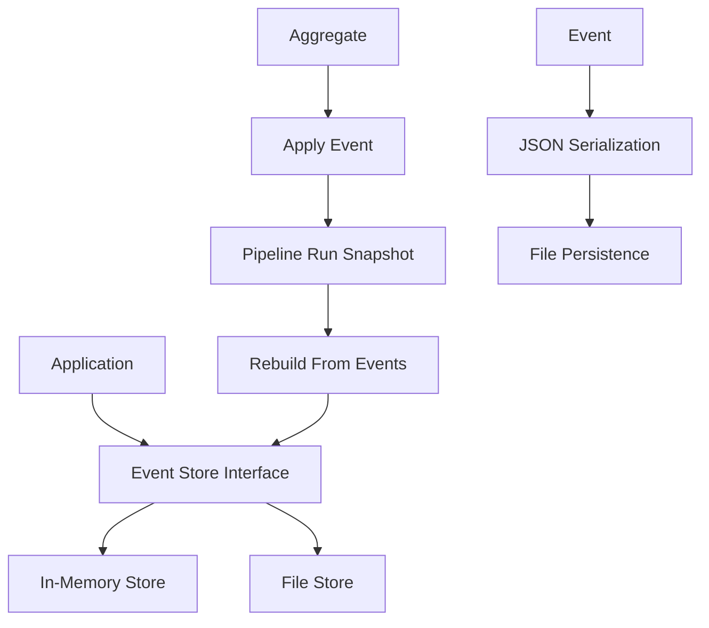

# NES-044 EventSourcing

## 1. Status
- Status: Draft
- Version: 0.1
- Owner: NAEOS Core Team

## 2. Purpose
This specification defines the event sourcing layer for NAEOS, providing immutable event storage, aggregate snapshots, and replay capabilities for pipeline runs and other domain events.

## 3. Scope
The event sourcing layer covers:
- Event store interface and implementations
- In-memory store for testing
- File-based store for persistence
- Aggregate pattern with snapshots
- Pipeline run snapshot with event replay
- Event serialization utilities

## 4. Requirements
### 4.1 Functional Requirements
- FR-001: Event store shall append events to streams.
- FR-001: Event store shall load events from streams.
- FR-003: Event store shall load events from a specific version.
- FR-004: In-memory store shall provide thread-safe access.
- FR-005: File store shall persist events as JSON.
- FR-006: Aggregates shall support event application.
- FR-007: Pipeline run snapshots shall rebuild from events.

### 4.2 Non-Functional Requirements
- NFR-001: Events shall be immutable once appended.
- NFR-002: Event versions shall be sequential per stream.
- NFR-003: File store shall use atomic writes.

## 5. Architecture



## 6. Core Types

### 6.1 Event

```go
type Event struct {
    ID        string         `json:"id"`
    StreamID  string         `json:"stream_id"`
    Type      string         `json:"type"`
    Data      map[string]any `json:"data"`
    Version   int            `json:"version"`
    Timestamp time.Time      `json:"timestamp"`
}
```

### 6.2 EventStore Interface

```go
type EventStore interface {
    Append(streamID string, events []Event) error
    Load(streamID string) ([]Event, error)
    LoadFrom(streamID string, fromVersion int) ([]Event, error)
}
```

### 6.3 Aggregate

```go
type Aggregate struct {
    ID      string
    Version int
    Events  []Event
}

func (a *Aggregate) Apply(event Event)
func (a *Aggregate) ToJSON() ([]byte, error)
```

## 7. In-Memory Store

```go
type InMemoryStore struct {
    streams map[string][]Event
    mu      sync.RWMutex
}

func NewInMemoryStore() *InMemoryStore
func (s *InMemoryStore) Append(streamID string, events []Event) error
func (s *InMemoryStore) Load(streamID string) ([]Event, error)
func (s *InMemoryStore) LoadFrom(streamID string, fromVersion int) ([]Event, error)
func (s *InMemoryStore) StreamCount() int
func (s *InMemoryStore) EventCount(streamID string) int
```

| Feature | Description |
|---------|-------------|
| Thread Safety | `sync.RWMutex` for concurrent access |
| Versioning | Auto-increments version per stream |
| Timestamps | Auto-sets if zero |
| Copy on Load | Returns copy to prevent mutation |

## 8. File Store

```go
type FileStore struct {
    dir string
    mu  sync.RWMutex
}

func NewFileStore(dir string) *FileStore
func (s *FileStore) Append(streamID string, events []Event) error
func (s *FileStore) Load(streamID string) ([]Event, error)
func (s *FileStore) LoadFrom(streamID string, fromVersion int) ([]Event, error)
func (s *FileStore) StreamIDs() ([]string, error)
```

| Feature | Description |
|---------|-------------|
| Persistence | JSON files per stream |
| File Format | `{streamID}.json` |
| Directory | Created automatically |
| Atomic Write | Full file rewrite |
| Thread Safety | `sync.RWMutex` |

## 9. Pipeline Run Snapshot

```go
type PipelineRunSnapshot struct {
    Aggregate
    Name       string         `json:"name"`
    Status     string         `json:"status"`
    Artifacts  int            `json:"artifacts"`
    Error      string         `json:"error,omitempty"`
    Metadata   map[string]any `json:"metadata,omitempty"`
}

func NewPipelineRun(id, name string) *PipelineRunSnapshot
func (s *PipelineRunSnapshot) Started()
func (s *PipelineRunSnapshot) StageCompleted(stage string, artifacts int)
func (s *PipelineRunSnapshot) Completed(artifacts int)
func (s *PipelineRunSnapshot) Failed(err error)
```

### Event Types

| Event | Status | Data |
|-------|--------|------|
| `pipeline.started` | `started` | `{name}` |
| `pipeline.stage_completed` | `running` | `{stage, artifacts}` |
| `pipeline.completed` | `completed` | `{artifacts}` |
| `pipeline.failed` | `failed` | `{error}` |

### Rebuild from Events

```go
func RebuildFromEvents(id string, events []Event) *PipelineRunSnapshot
```

Reconstructs a `PipelineRunSnapshot` by replaying events in order.

## 10. Event Utilities

| Function | Description |
|----------|-------------|
| `EventToJSON(e Event)` | Serialize event to JSON |
| `EventFromJSON(data []byte)` | Deserialize event from JSON |
| `FormatEvent(e Event)` | Format event as string |

## 11. Integration Points

| Consumer | How It Uses EventSourcing |
|----------|---------------------------|
| `internal/api/server.go` | Records pipeline runs |
| `internal/pipelinecache/` | Caches pipeline results |
| `cmd/naeos/status_cmd.go` | Shows pipeline history |

## 12. Acceptance Criteria
- [ ] Events are appended with correct versioning.
- [ ] Events can be loaded from specific versions.
- [ ] In-memory store is thread-safe.
- [ ] File store persists events as JSON.
- [ ] Pipeline run snapshots rebuild from events.
- [ ] Event serialization works correctly.
