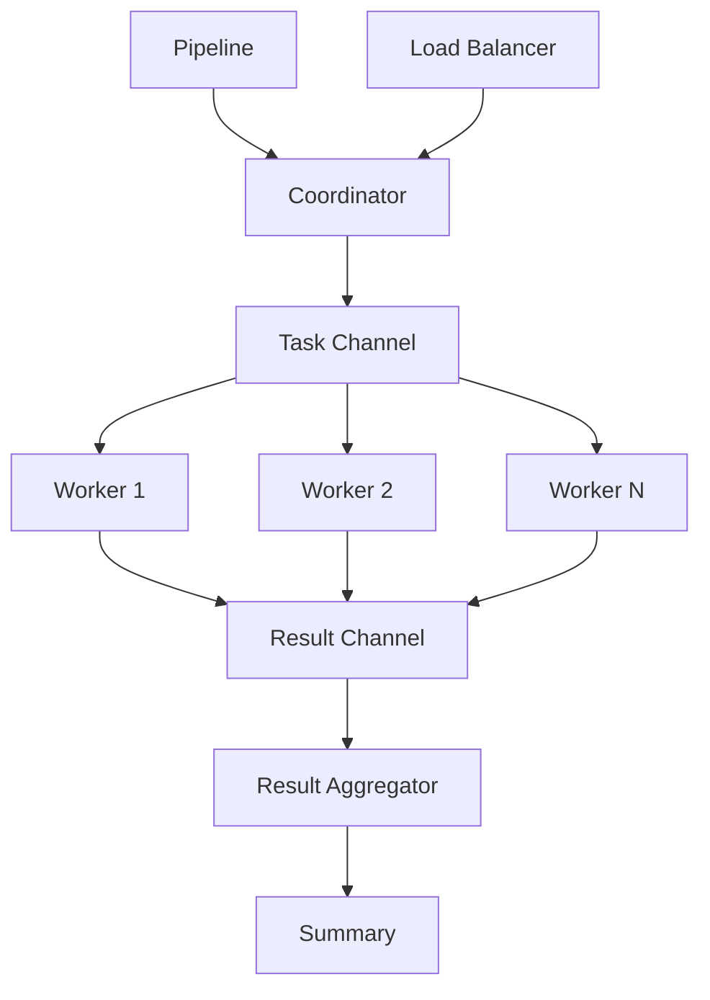

# NES-045 Distributed

## 1. Status
- Status: Draft
- Version: 0.1
- Owner: NAEOS Core Team

## 2. Purpose
This specification defines the distributed task execution layer for NAEOS, providing worker pools, task coordination, load balancing, and result aggregation for parallel pipeline processing.

## 3. Scope
The distributed layer covers:
- Worker interface and implementations
- Coordinator for task distribution
- Load balancer for worker selection
- Result aggregator for collecting outcomes
- Context-based cancellation and timeouts

## 4. Requirements
### 4.1 Functional Requirements
- FR-001: Coordinator shall distribute tasks to available workers.
- FR-002: Workers shall execute tasks concurrently.
- FR-003: Load balancer shall distribute tasks evenly across workers.
- FR-004: Result aggregator shall collect and summarize results.
- FR-005: System shall support graceful shutdown via context cancellation.

### 4.2 Non-Functional Requirements
- NFR-001: Worker pool shall be thread-safe.
- NFR-002: Task queue shall have configurable size.
- NFR-003: Results shall include latency measurements.

## 5. Architecture



## 6. Core Types

### 6.1 Task

```go
type Task struct {
    ID       string         `json:"id"`
    Type     string         `json:"type"`
    Payload  map[string]any `json:"payload"`
    Priority int            `json:"priority"`
}
```

### 6.2 TaskResult

```go
type TaskResult struct {
    TaskID  string         `json:"task_id"`
    Output  map[string]any `json:"output"`
    Error   string         `json:"error,omitempty"`
    Worker  string         `json:"worker"`
    Latency time.Duration  `json:"latency"`
}
```

### 6.3 Worker Interface

```go
type Worker interface {
    ID() string
    Execute(ctx context.Context, task *Task) (*TaskResult, error)
}
```

## 7. Coordinator

```go
type Coordinator struct {
    workers  []Worker
    taskCh   chan *Task
    resultCh chan *TaskResult
    mu       sync.RWMutex
    wg       sync.WaitGroup
}

func NewCoordinator(workers []Worker, queueSize int) *Coordinator
func (c *Coordinator) Submit(task *Task)
func (c *Coordinator) Start(ctx context.Context)
func (c *Coordinator) Results() <-chan *TaskResult
func (c *Coordinator) Stop()
func (c *Coordinator) WorkerCount() int
```

### Coordinator Methods

| Method | Description |
|--------|-------------|
| `Submit(task)` | Add task to queue (blocks if full) |
| `Start(ctx)` | Start all worker goroutines |
| `Results()` | Get read-only result channel |
| `Stop()` | Close task channel, wait for workers |
| `WorkerCount()` | Get number of registered workers |

### Task Queue

| Parameter | Default | Description |
|-----------|---------|-------------|
| Queue Size | 100 | Buffered channel capacity |
| Blocking Submit | — | Blocks when queue is full |
| Context Cancel | — | Stops workers gracefully |

## 8. SimpleWorker

```go
type SimpleWorker struct {
    workerID string
    handler  func(ctx context.Context, task *Task) (map[string]any, error)
}

func NewSimpleWorker(id string, handler func(ctx context.Context, task *Task) (map[string]any, error)) *SimpleWorker
func (w *SimpleWorker) ID() string
func (w *SimpleWorker) Execute(ctx context.Context, task *Task) (*TaskResult, error)
```

| Feature | Description |
|---------|-------------|
| Function-based | Handler function as worker logic |
| Error Handling | Returns error as TaskResult |
| Latency Tracking | Measured by Coordinator |

## 9. Load Balancer

```go
type LoadBalancer struct {
    workers []Worker
    counter uint64
    mu      sync.Mutex
}

func NewLoadBalancer(workers []Worker) *LoadBalancer
func (lb *LoadBalancer) Next() Worker
func (lb *LoadBalancer) WorkerCount() int
```

| Strategy | Description |
|----------|-------------|
| Round-Robin | Cycles through workers sequentially |
| Thread-Safe | Mutex-protected counter |
| Nil-safe | Returns nil if no workers |

## 10. Result Aggregator

```go
type ResultAggregator struct {
    results []TaskResult
    mu      sync.Mutex
}

func NewResultAggregator() *ResultAggregator
func (ra *ResultAggregator) Add(result TaskResult)
func (ra *ResultAggregator) All() []TaskResult
func (ra *ResultAggregator) Failed() []TaskResult
func (ra *ResultAggregator) Count() int
func (ra *ResultAggregator) Summary() string
```

### Aggregator Methods

| Method | Description |
|--------|-------------|
| `Add(result)` | Add result to collection |
| `All()` | Get all results (copy) |
| `Failed()` | Get only failed results |
| `Count()` | Get total result count |
| `Summary()` | Get summary string (e.g., "10 total, 8 succeeded, 2 failed") |

## 11. Usage Example

```go
// Create workers
workers := []distributed.Worker{
    distributed.NewSimpleWorker("worker-1", myHandler),
    distributed.NewSimpleWorker("worker-2", myHandler),
}

// Create coordinator
coord := distributed.NewCoordinator(workers, 50)

// Start workers
ctx, cancel := context.WithTimeout(context.Background(), 30*time.Second)
defer cancel()
coord.Start(ctx)

// Submit tasks
coord.Submit(&distributed.Task{
    ID:      "task-1",
    Type:    "compile",
    Payload: map[string]any{"spec": "my-spec.nes"},
})

// Collect results
aggregator := distributed.NewResultAggregator()
for result := range coord.Results() {
    aggregator.Add(*result)
}

// Shutdown
coord.Stop()
fmt.Println(aggregator.Summary())
```

## 12. Integration Points

| Consumer | How It Uses Distributed |
|----------|------------------------|
| `pkg/pipeline/pipeline.go` | Parallel stage execution |
| `internal/api/server.go` | API-triggered parallel tasks |

## 13. Acceptance Criteria
- [ ] Coordinator distributes tasks to workers correctly.
- [ ] Workers execute tasks concurrently.
- [ ] Load balancer distributes tasks evenly.
- [ ] Result aggregator collects all results.
- [ ] Graceful shutdown works via context cancellation.
- [ ] Latency is measured correctly.
