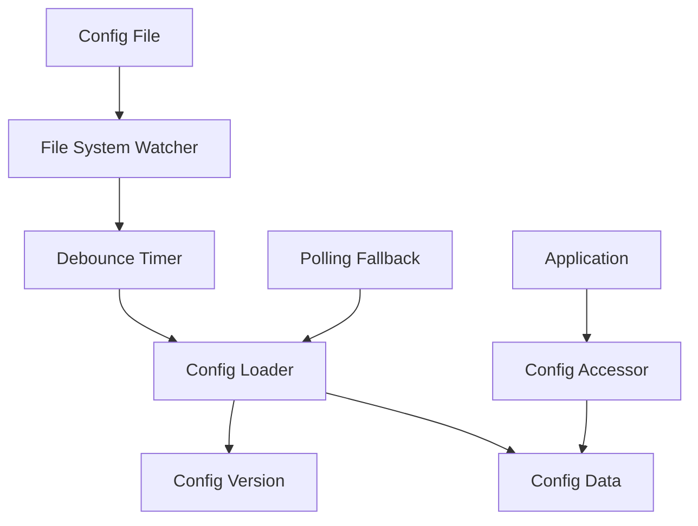
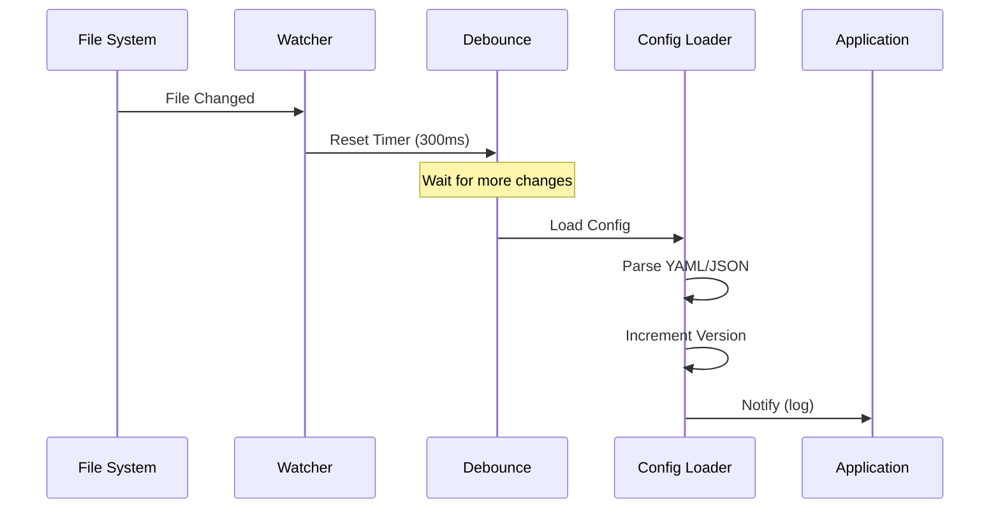

# NES-046 Config Hot-Reload

## 1. Status
- Status: Draft
- Version: 0.1
- Owner: NAEOS Core Team

## 2. Purpose
This specification defines the configuration hot-reload layer for NAEOS, enabling live configuration changes without server restarts using file system notifications and polling fallback.

## 3. Scope
The config hot-reload layer covers:
- File system watcher (fsnotify)
- Polling fallback for unsupported file systems
- Debounced reload to prevent rapid re-renders
- Config versioning for change detection
- Thread-safe access to configuration

## 4. Requirements
### 4.1 Functional Requirements
- FR-001: System shall detect configuration file changes automatically.
- FR-002: System shall reload configuration without server restart.
- FR-003: System shall debounce rapid file changes.
- FR-004: System shall support graceful start/stop.
- FR-005: System shall log reload events.

### 4.2 Non-Functional Requirements
- NFR-001: Reload shall not block the main thread.
- NFR-002: Configuration access shall be thread-safe.
- NFR-003: System shall handle file system errors gracefully.

## 5. Architecture



## 6. Core Types

### 6.1 Config

```go
type Config struct {
    filePath string
    data     map[string]any
    version  int
    mu       sync.RWMutex
}

func LoadFromFile(path string) (*Config, error)
func (c *Config) Load() error
func (c *Config) Get(key string) any
func (c *Config) GetString(key string) string
func (c *Config) GetInt(key string) int
func (c *Config) Version() int
```

### 6.2 HotReloader

```go
type HotReloader struct {
    config   *Config
    watcher  *fsnotify.Watcher
    interval time.Duration
    stopCh   chan struct{}
    running  bool
    mu       sync.RWMutex
}

func NewHotReloader(config *Config) *HotReloader
func (hr *HotReloader) Start() error
func (hr *HotReloader) Stop()
func (hr *HotReloader) IsRunning() bool
```

## 7. File System Watcher

| Feature | Description |
|---------|-------------|
| Library | `github.com/fsnotify/fsnotify` |
| Events | Write, Create |
| Debounce | 300ms |
| Directory | Watches parent directory of config file |
| Error Handling | Logs and continues |

### Event Flow



## 8. Debounce Mechanism

| Parameter | Value | Description |
|-----------|-------|-------------|
| Debounce Delay | 300ms | Wait after last change |
| Timer Reset | On each change | Restarts countdown |
| Action | Load config | After debounce expires |

## 9. Config Versioning

```go
func (c *Config) Version() int {
    c.mu.RLock()
    defer c.mu.RUnlock()
    return c.version
}
```

| Feature | Description |
|---------|-------------|
| Auto-increment | Version increments on each load |
| Thread-safe | RWMutex protected |
| Change Detection | Compare versions to detect changes |

## 10. Thread Safety

| Operation | Lock Type | Description |
|-----------|-----------|-------------|
| Read | RLock | Multiple readers allowed |
| Write | Lock | Exclusive write access |
| Version | RLock | Read-only version check |

## 11. Usage Example

```go
// Load config
config, err := configreload.LoadFromFile("config.yaml")
if err != nil {
    log.Fatal(err)
}

// Start hot reload
reloader := configreload.NewHotReloader(config)
if err := reloader.Start(); err != nil {
    log.Fatal(err)
}
defer reloader.Stop()

// Use config
fmt.Println("DB Host:", config.GetString("database.host"))
fmt.Println("Version:", config.Version())
```

## 12. Integration Points

| Consumer | How It Uses Config Hot-Reload |
|----------|------------------------------|
| `cmd/naeos/daemon_cmd.go` | Reloads API server config |
| `cmd/naeos/serve_cmd.go` | Reloads pipeline config |

## 13. Acceptance Criteria
- [ ] File changes are detected automatically.
- [ ] Configuration reloads without server restart.
- [ ] Rapid changes are debounced correctly.
- [ ] Start/stop lifecycle works correctly.
- [ ] Thread-safe access to configuration.
- [ ] Reload events are logged.
