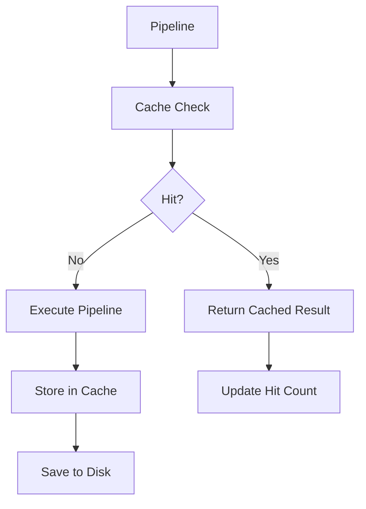

# NES-047 Pipeline Cache

## 1. Status
- Status: Draft
- Version: 0.1
- Owner: NAEOS Core Team

## 2. Purpose
This specification defines the pipeline cache layer for NAEOS, providing content-addressable caching for pipeline results to avoid redundant executions and improve performance.

## 3. Scope
The pipeline cache layer covers:
- SHA-256 content-addressable caching
- LRU eviction with configurable max size
- TTL-based expiration
- File-based persistence
- Thread-safe access

## 4. Requirements
### 4.1 Functional Requirements
- FR-001: Cache shall store pipeline results by content hash.
- FR-002: Cache shall evict least-recently-used entries when full.
- FR-003: Cache shall expire entries after configurable TTL.
- FR-004: Cache shall persist to disk as JSON.
- FR-005: Cache shall load existing entries on startup.

### 4.2 Non-Functional Requirements
- NFR-001: Cache access shall be thread-safe.
- NFR-002: Cache operations shall not block the main thread.
- NFR-003: Cache shall handle disk errors gracefully.

## 5. Architecture



## 6. Core Types

### 6.1 CacheEntry

```go
type CacheEntry struct {
    Key       string            `json:"key"`
    Result    *pipeline.Result  `json:"-"`
    Timestamp time.Time         `json:"timestamp"`
    HitCount  int               `json:"hit_count"`
}
```

### 6.2 Cache

```go
type Cache struct {
    dir     string
    entries map[string]*CacheEntry
    maxSize int
    maxAge  time.Duration
    mu      sync.RWMutex
}

func New(dir string, maxSize int) *Cache
func (c *Cache) Get(specHash string) (*pipeline.Result, bool)
func (c *Cache) Set(specHash string, result *pipeline.Result)
func (c *Cache) HashSpec(spec string) string
func (c *Cache) Invalidate(specHash string)
func (c *Cache) Clear()
func (c *Cache) Size() int
func (c *Cache) SetMaxAge(d time.Duration)
```

## 7. Content-Addressable Hashing

```go
func (c *Cache) HashSpec(spec string) string {
    h := sha256.Sum256([]byte(spec))
    return fmt.Sprintf("%x", h)
}
```

| Feature | Description |
|---------|-------------|
| Algorithm | SHA-256 |
| Input | Specification content |
| Output | Hex-encoded hash (64 chars) |
| Purpose | Content-addressable storage |

## 8. LRU Eviction

```go
func (c *Cache) evictLRU() {
    // Score = HitCount * 1000 + Timestamp
    // Evict entry with lowest score
}
```

| Feature | Description |
|---------|-------------|
| Trigger | When cache reaches maxSize |
| Strategy | Least Recently Used (LRU) |
| Scoring | HitCount * 1000 + UnixNano/1e9 |
| Action | Remove entry + disk file |

## 9. TTL Expiration

```go
func (c *Cache) SetMaxAge(d time.Duration) {
    c.mu.Lock()
    defer c.mu.Unlock()
    c.maxAge = d
}
```

| Feature | Description |
|---------|-------------|
| Default | No expiration |
| Configuration | `SetMaxAge(duration)` |
| Check | On `Get()` call |
| Action | Delete expired entry + disk file |

## 10. File Persistence

| Operation | Action |
|-----------|--------|
| `Set()` | Save to `{dir}/{key}.json` |
| `Get()` | Load from memory |
| `Invalidate()` | Delete `{dir}/{key}.json` |
| `Clear()` | Delete all `{dir}/*.json` |
| `New()` | Load all `{dir}/*.json` |

### File Format

```json
{
  "key": "abc123...",
  "timestamp": "2025-01-15T10:30:00Z",
  "hit_count": 5
}
```

Note: `Result` is not persisted (marked `json:"-"`).

## 11. Usage Example

```go
// Create cache
cache := pipelinecache.New("./cache", 100)
cache.SetMaxAge(1 * time.Hour)

// Hash spec
hash := cache.HashSpec(specContent)

// Check cache
if result, ok := cache.Get(hash); ok {
    fmt.Println("Cache hit!")
    return result
}

// Execute pipeline
result := pipeline.Execute(spec)

// Store in cache
cache.Set(hash, result)

// Invalidate
cache.Invalidate(hash)
```

## 12. Integration Points

| Consumer | How It Uses PipelineCache |
|----------|--------------------------|
| `cmd/naeos/compile_cmd.go` | Caches compilation results |
| `cmd/naeos/build_cmd.go` | Caches build results |
| `pkg/pipeline/pipeline.go` | Caches pipeline results |

## 13. Acceptance Criteria
- [ ] Cache stores results by content hash.
- [ ] LRU eviction works correctly.
- [ ] TTL expiration works correctly.
- [ ] File persistence works correctly.
- [ ] Thread-safe access is maintained.
- [ ] Cache loads existing entries on startup.
