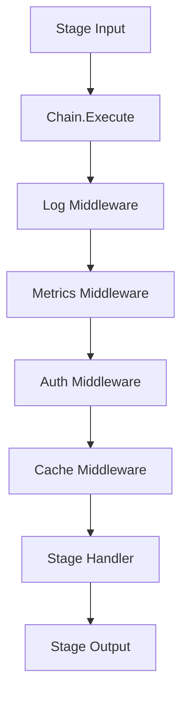

# NES-048 Pipeline Middleware

## 1. Status
- Status: Draft
- Version: 0.1
- Owner: NAEOS Core Team

## 2. Purpose
This specification defines the pipeline middleware layer for NAEOS, providing composable decorators for logging, metrics, authentication, and caching in pipeline stages.

## 3. Scope
The pipeline middleware layer covers:
- Middleware interface and chain pattern
- Log middleware for stage execution logging
- Metrics middleware for duration recording
- Auth middleware for token validation
- Cache middleware for result caching
- Stage-specific middleware application

## 4. Requirements
### 4.1 Functional Requirements
- FR-001: Middleware shall be composable via chain pattern.
- FR-002: Middleware shall wrap stage execution functions.
- FR-003: Log middleware shall log stage start, completion, and failure.
- FR-004: Metrics middleware shall record stage duration.
- FR-005: Auth middleware shall validate tokens from labels.
- FR-006: Cache middleware shall cache stage results.

### 4.2 Non-Functional Requirements
- NFR-001: Middleware shall not modify stage input/output structure.
- NFR-002: Middleware shall be stage-specific (not global).

## 5. Architecture



## 6. Core Types

### 6.1 StageFunc

```go
type StageFunc func(ctx context.Context, input *StageInput) (*StageOutput, error)
```

### 6.2 StageInput / StageOutput

```go
type StageInput struct {
    Stage  string
    Data   []byte
    Labels map[string]string
}

type StageOutput struct {
    Data   []byte
    Labels map[string]string
}
```

### 6.3 Middleware Interface

```go
type Middleware interface {
    Name() string
    Wrap(stage string, next StageFunc) StageFunc
}
```

## 7. Chain

```go
type Chain struct {
    middlewares map[string][]Middleware
}

func NewChain() *Chain
func (c *Chain) Use(stage string, mw Middleware)
func (c *Chain) Execute(stage string, input *StageInput, handler StageFunc) (*StageOutput, error)
```

| Method | Description |
|--------|-------------|
| `Use(stage, mw)` | Register middleware for a stage |
| `Execute(stage, input, handler)` | Execute with middleware chain |

### Execution Order

Middlewares execute in registration order (FIFO):
1. First registered → First to wrap → Last to execute
2. Last registered → Last to wrap → First to execute

## 8. Log Middleware

```go
type LogMiddleware struct {
    LogFunc func(msg string, args ...any)
}

func (l *LogMiddleware) Name() string { return "log" }
func (l *LogMiddleware) Wrap(stage string, next StageFunc) StageFunc
```

### Log Events

| Event | Level | Fields |
|-------|-------|--------|
| Stage start | Info | `stage` |
| Stage complete | Info | `stage`, `duration` |
| Stage failed | Error | `stage`, `duration`, `error` |

## 9. Metrics Middleware

```go
type MetricsMiddleware struct {
    RecordFunc func(stage string, duration time.Duration, err error)
}

func (m *MetricsMiddleware) Name() string { return "metrics" }
func (m *MetricsMiddleware) Wrap(stage string, next StageFunc) StageFunc
```

| Feature | Description |
|---------|-------------|
| Duration | Measured from start to completion |
| Error | Passed to RecordFunc for error tracking |
| Stage | Identifies which stage was measured |

## 10. Auth Middleware

```go
type AuthMiddleware struct {
    ValidateToken func(token string) error
    TokenHeader   string
}

func (a *AuthMiddleware) Name() string { return "auth" }
func (a *AuthMiddleware) Wrap(stage string, next StageFunc) StageFunc
```

| Feature | Description |
|---------|-------------|
| Token Source | `input.Labels[TokenHeader]` |
| Validation | `ValidateToken(token)` function |
| Error | Returns error if token missing or invalid |

### Error Messages

| Condition | Error |
|-----------|-------|
| Missing token | `missing auth token in label "{header}"` |
| Invalid token | `auth failed: {error}` |

## 11. Cache Middleware

```go
type CacheMiddleware struct {
    Get func(key string) ([]byte, bool)
    Set func(key string, data []byte)
}

func (c *CacheMiddleware) Name() string { return "cache" }
func (c *CacheMiddleware) Wrap(stage string, next StageFunc) StageFunc
```

| Feature | Description |
|---------|-------------|
| Cache Key | `{stage}:{hex(data)}` |
| Hit | Returns cached output |
| Miss | Executes handler, stores result |

## 12. Usage Example

```go
// Create chain
chain := middleware.NewChain()

// Register middlewares
chain.Use("compile", &middleware.LogMiddleware{LogFunc: slog.Info})
chain.Use("compile", &middleware.MetricsMiddleware{
    RecordFunc: func(stage string, d time.Duration, err error) {
        metrics.Record("stage_duration", d.Seconds(), "stage", stage)
    },
})
chain.Use("compile", &middleware.AuthMiddleware{
    ValidateToken: validateJWT,
    TokenHeader:   "x-auth-token",
})

// Execute
output, err := chain.Execute("compile", input, compileHandler)
```

## 13. Integration Points

| Consumer | How It Uses PipelineMiddleware |
|----------|-------------------------------|
| `pkg/pipeline/pipeline.go` | Wraps stage execution |
| `cmd/naeos/compile_cmd.go` | Adds logging and metrics |

## 14. Acceptance Criteria
- [ ] Middleware chain executes in correct order.
- [ ] Log middleware logs all stage events.
- [ ] Metrics middleware records duration correctly.
- [ ] Auth middleware validates tokens correctly.
- [ ] Cache middleware caches results correctly.
- [ ] Stage input/output is not modified by middleware.
