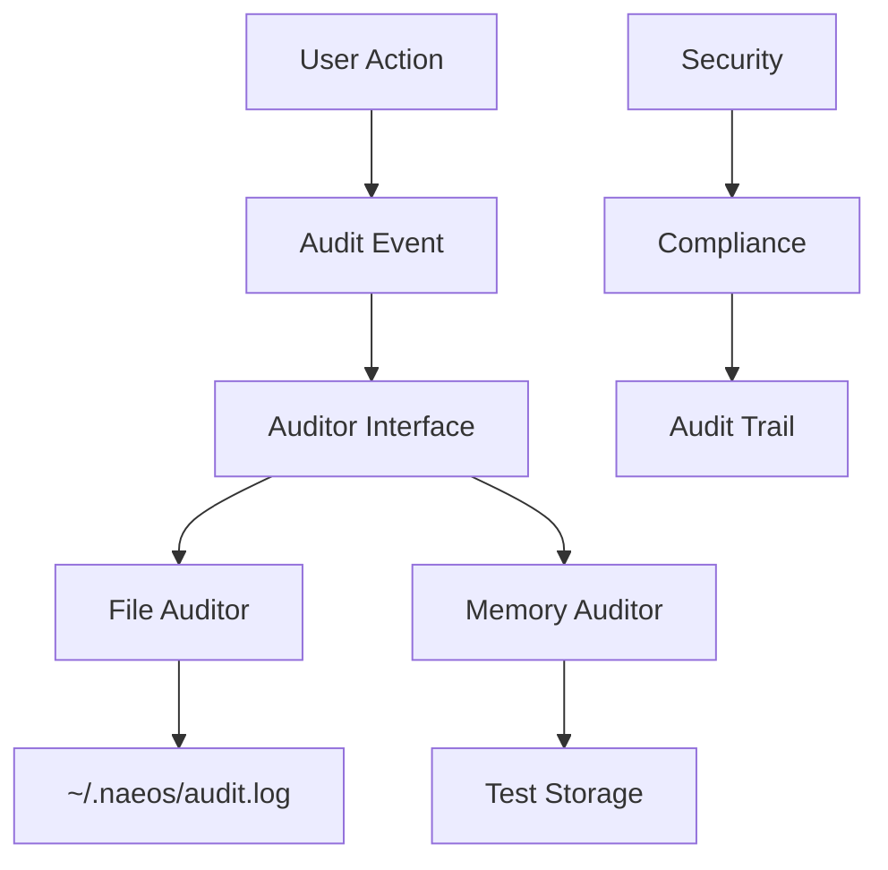

# NES-049 Audit Logging

## 1. Status
- Status: Draft
- Version: 0.1
- Owner: NAEOS Core Team

## 2. Purpose
This specification defines the audit logging layer for NAEOS, providing immutable audit trail for user actions, system events, and security-relevant operations.

## 3. Scope
The audit logging layer covers:
- Audit event structure
- File-based auditor for persistence
- In-memory auditor for testing
- Thread-safe event logging
- Event ID and timestamp generation

## 4. Requirements
### 4.1 Functional Requirements
- FR-001: System shall log all auditable actions.
- FR-002: Audit events shall include user, action, resource, and status.
- FR-003: Audit events shall have unique IDs and timestamps.
- FR-004: File auditor shall append to log file atomically.
- FR-005: In-memory auditor shall store events for testing.

### 4.2 Non-Functional Requirements
- NFR-001: Audit logging shall be thread-safe.
- NFR-002: Audit events shall be immutable once logged.
- NFR-003: Audit log files shall have restricted permissions (0600).

## 5. Architecture



## 6. Core Types

### 6.1 AuditEvent

```go
type AuditEvent struct {
    ID         string    `json:"id"`
    Timestamp  time.Time `json:"timestamp"`
    UserID     string    `json:"user_id"`
    Action     string    `json:"action"`
    Resource   string    `json:"resource"`
    ResourceID string    `json:"resource_id,omitempty"`
    IP         string    `json:"ip,omitempty"`
    UserAgent  string    `json:"user_agent,omitempty"`
    Status     string    `json:"status"`
    Details    string    `json:"details,omitempty"`
}
```

### 6.2 Auditor Interface

```go
type Auditor interface {
    Log(event AuditEvent) error
}
```

## 7. File Auditor

```go
type FileAuditor struct {
    path string
    mu   sync.Mutex
}

func NewFileAuditor(homeDir string) (*FileAuditor, error)
func (f *FileAuditor) Log(event AuditEvent) error
```

| Feature | Description |
|---------|-------------|
| Location | `~/.naeos/audit.log` |
| Format | JSON Lines (one event per line) |
| Permissions | 0600 (owner read/write only) |
| Thread Safety | Mutex-protected |
| Auto-generate | ID and Timestamp if zero |

### File Format

```json
{"id":"evt-1234567890","timestamp":"2025-01-15T10:30:00Z","user_id":"admin","action":"compile","resource":"spec","status":"success"}
```

## 8. Memory Auditor

```go
type MemoryAuditor struct {
    events []AuditEvent
    mu     sync.Mutex
}

func NewMemoryAuditor() *MemoryAuditor
func (m *MemoryAuditor) Log(event AuditEvent) error
func (m *MemoryAuditor) Events() []AuditEvent
func (m *MemoryAuditor) Clear()
```

| Feature | Description |
|---------|-------------|
| Storage | In-memory slice |
| Thread Safety | Mutex-protected |
| Query | `Events()` returns copy |
| Reset | `Clear()` removes all events |

## 9. Event Fields

| Field | Required | Description |
|-------|----------|-------------|
| `id` | Auto | Unique event identifier |
| `timestamp` | Auto | Event creation time |
| `user_id` | Yes | User who performed action |
| `action` | Yes | Action performed |
| `resource` | Yes | Resource affected |
| `resource_id` | No | Specific resource identifier |
| `ip` | No | Client IP address |
| `user_agent` | No | Client user agent |
| `status` | Yes | Action result (success/failure) |
| `details` | No | Additional details |

## 10. Usage Example

```go
// File auditor
auditor, err := audit.NewFileAuditor(os.Getenv("HOME"))
if err != nil {
    log.Fatal(err)
}

// Log event
err = auditor.Log(audit.AuditEvent{
    UserID:   "admin",
    Action:   "compile",
    Resource: "spec",
    Status:   "success",
})

// Memory auditor (testing)
memAuditor := audit.NewMemoryAuditor()
memAuditor.Log(audit.AuditEvent{
    UserID: "test",
    Action: "validate",
    Status: "success",
})
events := memAuditor.Events()
```

## 11. Integration Points

| Consumer | How It Uses AuditLogging |
|----------|-------------------------|
| `cmd/naeos/compile_cmd.go` | Logs compilation events |
| `cmd/naeos/db_cmd.go` | Logs database operations |
| `internal/api/server.go` | Logs API requests |

## 12. Acceptance Criteria
- [ ] Audit events are logged correctly.
- [ ] File auditor writes to correct location.
- [ ] File auditor uses correct permissions.
- [ ] In-memory auditor stores events correctly.
- [ ] Thread-safe access is maintained.
- [ ] Event IDs and timestamps are auto-generated.
