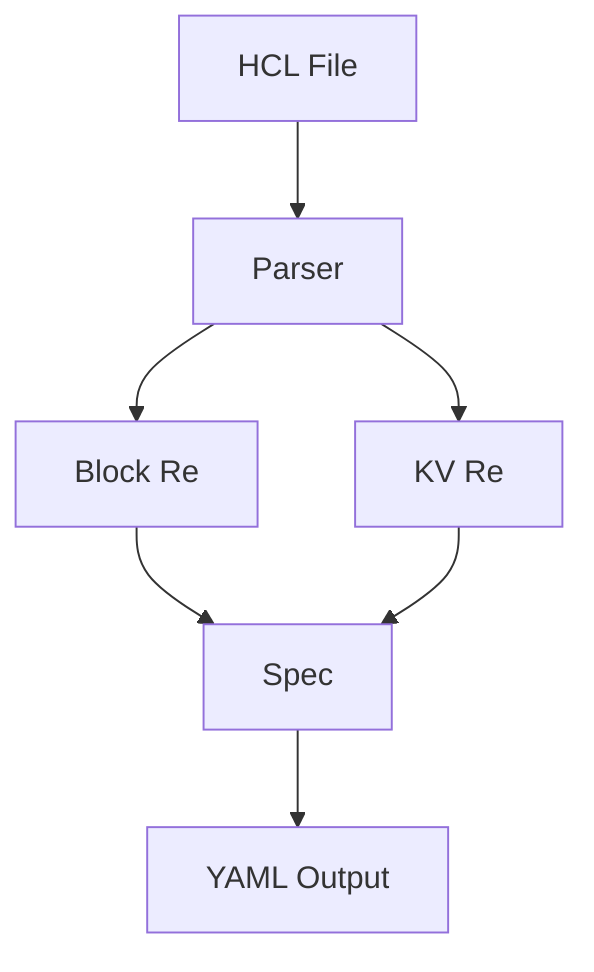

# NES-050 HCL Parser

## 1. Status
- Status: Draft
- Version: 0.1
- Owner: NAEOS Core Team

## 2. Purpose
This specification defines the HCL (HashiCorp Configuration Language) parser for NAEOS, enabling Terraform-style configuration parsing and conversion to YAML format.

## 3. Scope
The HCL parser covers:
- HCL file parsing via regex
- Spec extraction (project, services, infra)
- HCL to YAML conversion
- Comment handling (single-line, multi-line)

## 4. Requirements
### 4.1 Functional Requirements
- FR-001: Parser shall read HCL files from disk.
- FR-002: Parser shall extract project, service, and infra blocks.
- FR-003: Parser shall convert HCL to YAML format.
- FR-004: Parser shall handle comments (# and //).

### 4.2 Non-Functional Requirements
- NFR-001: Parser shall not require external HCL libraries.
- NFR-002: Parser shall handle malformed input gracefully.

## 5. Architecture



## 6. Core Types

### 6.1 Spec

```go
type Spec struct {
    Project  Project            `json:"project"`
    Services map[string]Service `json:"services"`
    Infra    Infra              `json:"infra"`
}

type Project struct {
    Name        string `json:"name"`
    Version     string `json:"version"`
    Description string `json:"description,omitempty"`
}

type Service struct {
    Image string `json:"image,omitempty"`
    Port  int    `json:"port,omitempty"`
    Type  string `json:"type"`
}

type Infra struct {
    Engine string `json:"engine,omitempty"`
}
```

## 7. Parser

```go
func ParseFile(path string) (*Spec, error)
func Parse(data []byte, filename string) (*Spec, error)
```

### Regex Patterns

| Pattern | Description |
|---------|-------------|
| `^(\w+)\s+"([^"]*)"\s*\{` | Block opening |
| `^\s*(\w+)\s*=\s*(.+)$` | Key-value pair |

### Block Types

| Block | Fields |
|-------|--------|
| `project` | `name`, `version`, `description` |
| `service` | `image`, `port`, `type` |
| `infra` | `engine` |

## 8. HCL to YAML

```go
func ToYAML(spec *Spec) ([]byte, error)
```

### Conversion Rules

| HCL | YAML |
|-----|------|
| `project "name" { ... }` | `project:\n  name: name` |
| `service "api" { ... }` | `services:\n  - name: api` |
| `infra "aws" { ... }` | `infra:\n  engine: aws` |

## 9. Usage Example

```go
// Parse HCL file
spec, err := hcl.ParseFile("infra.hcl")
if err != nil {
    log.Fatal(err)
}

fmt.Println("Project:", spec.Project.Name)
fmt.Println("Services:", len(spec.Services))

// Convert to YAML
yaml, err := hcl.ToYAML(spec)
if err != nil {
    log.Fatal(err)
}
fmt.Println(string(yaml))
```

## 10. Example HCL

```hcl
project "my-app" {
  version     = "1.0.0"
  description = "My application"
}

service "api" {
  image = "my-app-api"
  port  = 8080
  type  = "api"
}

service "worker" {
  image = "my-app-worker"
  type  = "worker"
}

infra "docker" {
  engine = "docker-compose"
}
```

## 11. Integration Points

| Consumer | How It Uses HCL Parser |
|----------|----------------------|
| `cmd/naeos/compile_cmd.go` | Parses HCL specifications |
| `cmd/naeos/build_cmd.go` | Reads HCL config |

## 12. Acceptance Criteria
- [ ] HCL files are parsed correctly.
- [ ] Project, service, and infra blocks are extracted.
- [ ] HCL to YAML conversion works correctly.
- [ ] Comments are ignored.
- [ ] Malformed input is handled gracefully.
