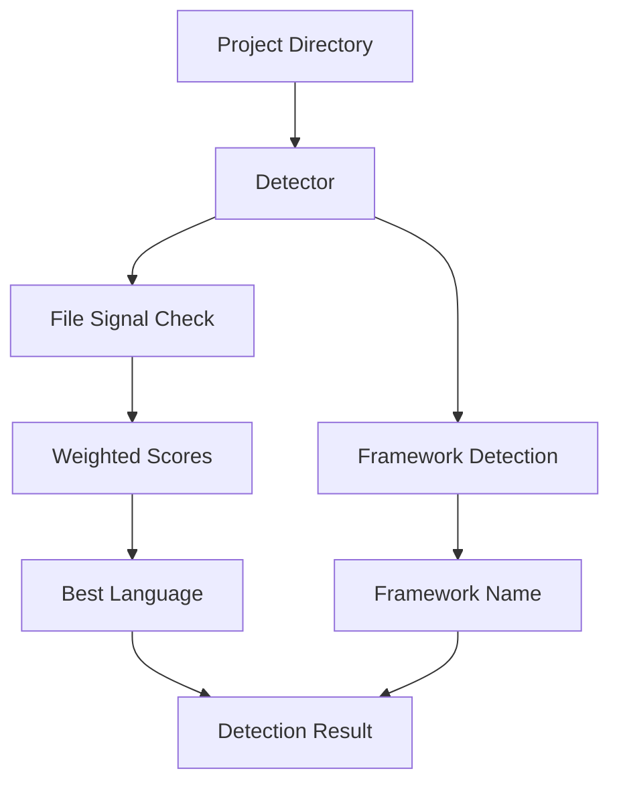

# NES-051 Profile Detection

## 1. Status
- Status: Draft
- Version: 0.1
- Owner: NAEOS Core Team

## 2. Purpose
This specification defines the profile detection layer for NAEOS, providing automatic language and framework detection for project repositories.

## 3. Scope
The profile detection layer covers:
- Language detection via file signals
- Framework detection via file content
- Confidence scoring
- Weighted signal aggregation

## 4. Requirements
### 4.1 Functional Requirements
- FR-001: System shall detect programming language from file signals.
- FR-002: System shall detect framework from file content.
- FR-003: System shall calculate confidence score.
- FR-004: System shall return matched files.

### 4.2 Non-Functional Requirements
- NFR-001: Detection shall complete in <100ms.
- NFR-002: Detection shall not modify the project.

## 5. Architecture



## 6. Core Types

### 6.1 DetectionResult

```go
type DetectionResult struct {
    Language   string   `json:"language"`
    Framework  string   `json:"framework"`
    Confidence float64  `json:"confidence"`
    Files      []string `json:"files"`
}
```

### 6.2 Detector

```go
type Detector struct {
    rootDir string
}

func NewDetector(rootDir string) *Detector
func (d *Detector) Detect() *DetectionResult
```

## 7. Language Detection

### File Signals

| File | Language | Weight |
|------|----------|--------|
| `go.mod` | Go | 1.0 |
| `go.sum` | Go | 0.3 |
| `package.json` | JavaScript | 0.7 |
| `tsconfig.json` | TypeScript | 0.9 |
| `package-lock.json` | JavaScript | 0.4 |
| `yarn.lock` | JavaScript | 0.4 |
| `pnpm-lock.yaml` | JavaScript | 0.4 |
| `requirements.txt` | Python | 0.8 |
| `setup.py` | Python | 0.8 |
| `pyproject.toml` | Python | 0.9 |
| `Pipfile` | Python | 0.7 |
| `Cargo.toml` | Rust | 1.0 |
| `Cargo.lock` | Rust | 0.3 |
| `pom.xml` | Java | 0.9 |
| `build.gradle` | Java | 0.9 |
| `build.gradle.kts` | Java | 0.9 |
| `Gemfile` | Ruby | 0.9 |
| `composer.json` | PHP | 0.9 |
| `main.go` | Go | 0.5 |
| `index.ts` | TypeScript | 0.4 |
| `index.js` | JavaScript | 0.4 |
| `app.py` | Python | 0.4 |
| `main.py` | Python | 0.4 |
| `src/main.rs` | Rust | 0.5 |
| `src/App.tsx` | TypeScript | 0.3 |
| `src/App.jsx` | JavaScript | 0.3 |

### Confidence Calculation

```go
confidence := bestScore / 2.0
if confidence > 1.0 {
    confidence = 1.0
}
```

| Score Range | Confidence |
|-------------|------------|
| 0-2 | 0.0-1.0 |
| >2 | 1.0 (capped) |

## 8. Framework Detection

### JavaScript/TypeScript Frameworks

| Framework | Detection |
|-----------|-----------|
| Next.js | `next` in package.json |
| React | `react` in package.json |
| Vue | `vue` in package.json |
| Angular | `angular` in package.json |
| Express | `express` in package.json |
| Fastify | `fastify` in package.json |
| NestJS | `nestjs` or `@nestjs` in package.json |

### Python Frameworks

| Framework | Detection |
|-----------|-----------|
| Django | `django` in pyproject.toml |
| FastAPI | `fastapi` in pyproject.toml |
| Flask | `flask` in pyproject.toml |

### Go Frameworks

| Framework | Detection |
|-----------|-----------|
| Gin | `gin-gonic` in go.mod |
| Gorilla | `gorilla/mux` in go.mod |
| Echo | `echo` in go.mod |
| Fiber | `fiber` in go.mod |

## 9. Usage Example

```go
// Create detector
detector := profiledetect.NewDetector("/path/to/project")

// Detect
result := detector.Detect()

fmt.Println("Language:", result.Language)
fmt.Println("Framework:", result.Framework)
fmt.Println("Confidence:", result.Confidence)
fmt.Println("Files:", result.Files)
```

## 10. Integration Points

| Consumer | How It Uses ProfileDetection |
|----------|----------------------------|
| `cmd/naeos/compile_cmd.go` | Auto-detects language for compilation |
| `cmd/naeos/build_cmd.go` | Selects build strategy |

## 11. Acceptance Criteria
- [ ] Language detection works for all supported languages.
- [ ] Framework detection works for all supported frameworks.
- [ ] Confidence score is calculated correctly.
- [ ] Matched files are returned correctly.
- [ ] Detection completes in <100ms.
