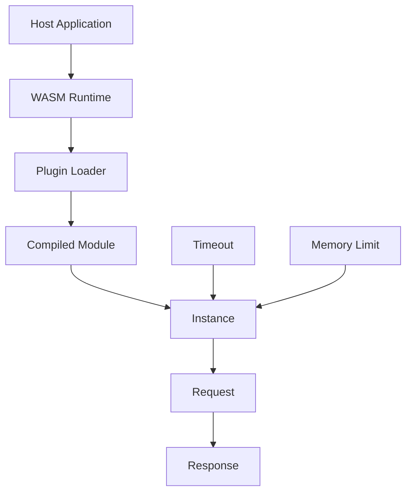
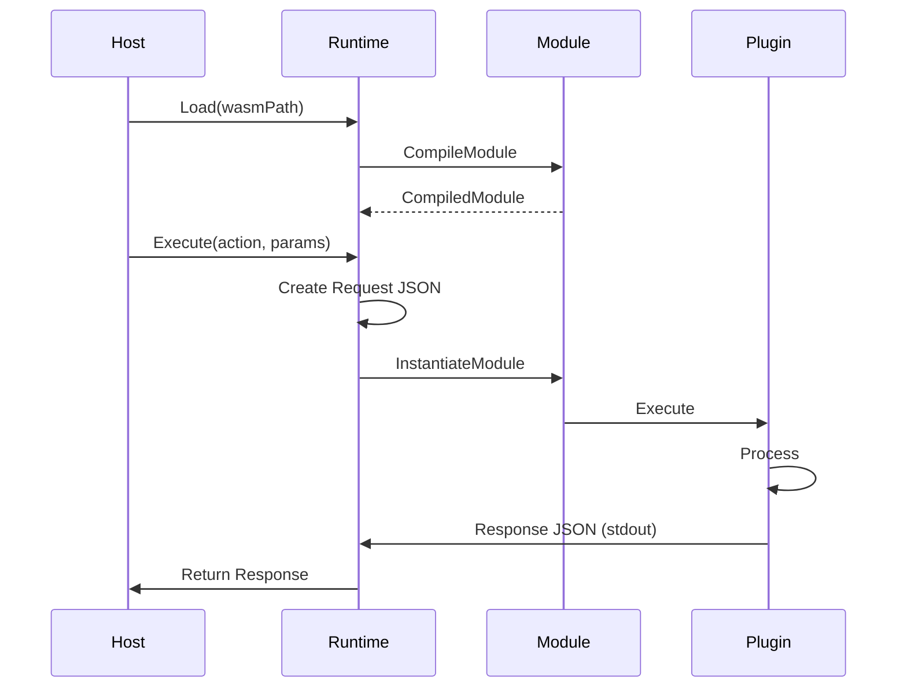

# NES-053 WASM Plugin

## 1. Status
- Status: Draft
- Version: 0.1
- Owner: NAEOS Core Team

## 2. Purpose
This specification defines the WASM plugin layer for NAEOS, enabling sandboxed execution of third-party plugins via WebAssembly runtime.

## 3. Scope
The WASM plugin layer covers:
- WASM runtime initialization (wazero)
- Plugin loading and compilation
- Sandboxed execution with memory limits
- Request/Response protocol
- Timeout and error handling

## 4. Requirements
### 4.1 Functional Requirements
- FR-001: System shall load and compile WASM modules.
- FR-002: System shall execute WASM plugins with timeouts.
- FR-003: System shall limit memory usage per plugin.
- FR-004: System shall support JSON request/response protocol.
- FR-005: System shall capture stdout/stderr from plugins.

### 4.2 Non-Functional Requirements
- NFR-001: Plugins shall run in sandboxed environment.
- NFR-002: Plugins shall not access host filesystem.
- NFR-003: Plugins shall be isolated from each other.

## 5. Architecture



## 6. Core Types

### 6.1 WASMRuntime

```go
type WASMRuntime struct {
    timeout   time.Duration
    maxMemory int64
    rt        wazero.Runtime
}

func NewWASMRuntime(timeout time.Duration, maxMemory int64) *WASMRuntime
func (w *WASMRuntime) Load(wasmPath string) (*WASMPlugin, error)
func (w *WASMRuntime) Close() error
```

### 6.2 WASMPlugin

```go
type WASMPlugin struct {
    wasmRuntime *WASMRuntime
    wasmPath    string
    name        string
    version     string
    description string
    compiled    wazero.CompiledModule
}

func (p *WASMPlugin) Name() string
func (p *WASMPlugin) Version() string
func (p *WASMPlugin) Description() string
func (p *WASMPlugin) Initialize(_ any) error
func (p *WASMPlugin) Execute(action string, params map[string]any) (any, error)
func (p *WASMPlugin) Shutdown() error
```

## 7. Request/Response Protocol

### Request

```go
type Request struct {
    Method string         `json:"method"`
    Params map[string]any `json:"params"`
}
```

### Response

```go
type Response struct {
    OK      bool   `json:"ok"`
    Result  any    `json:"result,omitempty"`
    Error   string `json:"error,omitempty"`
    Elapsed int64  `json:"elapsed_ms"`
}
```

## 8. Execution Model



## 9. Runtime Configuration

| Parameter | Default | Description |
|-----------|---------|-------------|
| Timeout | 30s | Maximum execution time |
| Max Memory | 128MB | Maximum memory usage |
| WASI | Preview 1 | WASI compatibility |

## 10. Security

| Feature | Description |
|---------|-------------|
| Sandboxing | No host filesystem access |
| Memory Limit | Configurable per runtime |
| Timeout | Configurable per runtime |
| Isolation | Separate instance per execution |

## 11. Usage Example

```go
// Create runtime
runtime := wasm.NewWASMRuntime(30*time.Second, 128*1024*1024)
defer runtime.Close()

// Load plugin
plugin, err := runtime.Load("plugin.wasm")
if err != nil {
    log.Fatal(err)
}

// Execute
resp, err := plugin.Execute("transform", map[string]any{
    "input": "data",
})

// Check response
if resp.(*wasm.Response).OK {
    fmt.Println("Result:", resp.(*wasm.Response).Result)
}
```

## 12. Integration Points

| Consumer | How It Uses WASM Plugin |
|----------|------------------------|
| `cmd/naeos/plugin_cmd.go` | CLI plugin management |
| `internal/pluginsdk/` | Plugin SDK |

## 13. Acceptance Criteria
- [ ] WASM modules are loaded and compiled correctly.
- [ ] Execution respects timeout limits.
- [ ] Memory limits are enforced.
- [ ] Request/Response protocol works correctly.
- [ ] stdout/stderr are captured correctly.
- [ ] Plugins run in sandboxed environment.
